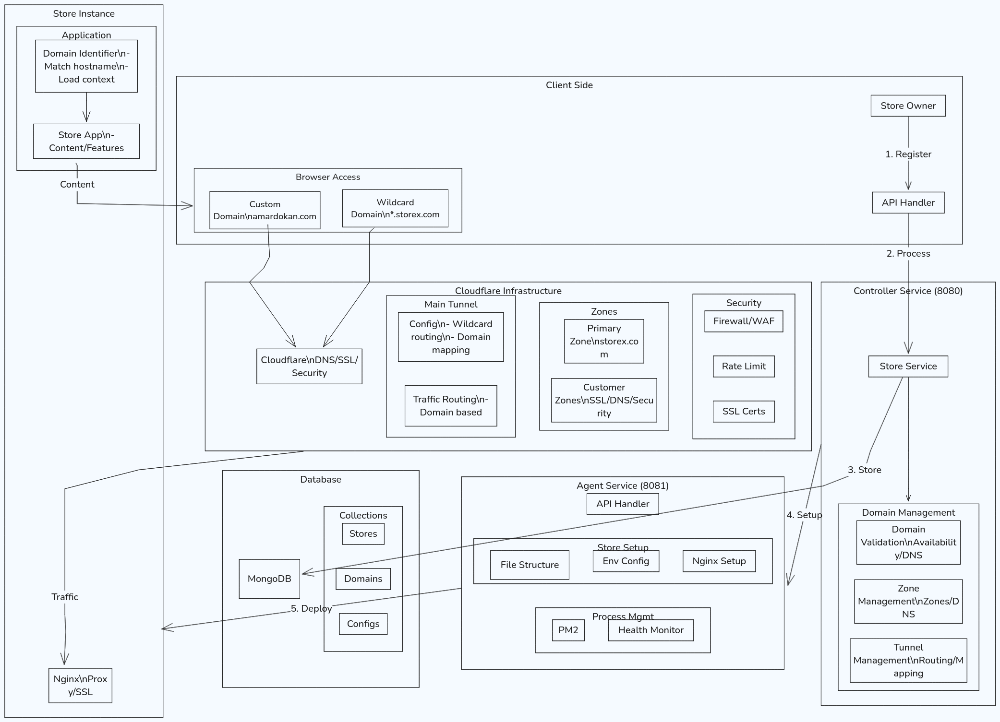

# Controller Service with Cloudflare Integration


## Table of Contents
1. [System Overview](#system-overview)
2. [Infrastructure Layer](#infrastructure-layer)
3. [Application Layer](#application-layer)
4. [Management Layer](#management-layer)
5. [Complete End-to-End Flow](#complete-end-to-end-flow)
6. [API Interactions and Payloads](#api-interactions-and-payloads)
7. [Configuration Examples](#configuration-examples)
8. [Use Case Scenarios](#use-case-scenarios)
9. [System Operations](#system-operations)
10. [Troubleshooting Guide](#troubleshooting-guide)


# Part 1: Technical Documentation and System Architecture

## System Overview

The Controller Service functions as a sophisticated reverse proxy and domain management system that enables multiple e-commerce stores to operate under a unified infrastructure while maintaining complete isolation. At its core, the system leverages Cloudflare's enterprise-grade infrastructure through a single tunnel architecture, providing secure and efficient routing for all store instances. This approach significantly simplifies domain management, security implementation, and scaling capabilities while reducing infrastructure overhead.

The system's foundational architecture revolves around a unique domain management strategy where each store operates with dual domain configurations. Every store receives an automatically generated subdomain under the system's primary domain (*.storex.com) while maintaining the ability to use custom domains (e.g., customstore.com). This dual-domain approach ensures immediate store accessibility through the system subdomain while allowing for professional branding via custom domains. The architecture provides built-in redundancy and facilitates testing environments without additional infrastructure requirements.

Despite sharing common infrastructure components like the Cloudflare tunnel, DNS management system, and SSL/TLS certificates, each store maintains complete isolation through separate database instances, isolated process management, and domain-based routing. This isolation ensures that potential issues in one store cannot affect others, while the shared infrastructure components optimize resource utilization and simplify management overhead.

The traffic management system implements a sophisticated routing mechanism that begins at Cloudflare's edge network. When a request arrives, it passes through multiple layers of security and optimization before reaching the appropriate store instance. This includes DDoS protection, Web Application Firewall (WAF) rules, bot protection, and SSL/TLS encryption at the edge. The Cloudflare tunnel then securely routes the traffic to the internal system, where domain-based identification ensures requests reach the correct store instance.



## Infrastructure Layer

### Cloudflare Integration

The Cloudflare integration serves as the primary interface for domain management and security. The system maintains a single tunnel that efficiently handles all incoming traffic while providing enterprise-grade security features. This tunnel configuration supports multiple domains and subdomains, all managed through a centralized control system.

The DNS management system operates automatically through Cloudflare's API, handling record creation, updates, and health monitoring. Each domain undergoes automatic verification and continuous health checks to ensure optimal performance and availability. The system supports various record types including A, CNAME, TXT, and MX records, with automated management and propagation monitoring.

SSL/TLS certificates are automatically provisioned and managed through Cloudflare, ensuring secure connections for all domains. The system implements a hybrid approach where the primary wildcard certificate covers all system subdomains, while individual SSL certificates are managed for custom domains.

Example DNS Configuration:
```javascript
{
  "zone_management": {
    "primary_domain": "storex.com",
    "wildcard_ssl": true,
    "dns_records": {
      "type": "CNAME",
      "name": "*.storex.com",
      "content": "tunnel.storex.com",
      "proxied": true
    }
  }
}
```

### Network Architecture

The network architecture implements a layered approach to traffic management and security. All incoming requests first hit Cloudflare's edge network, where they undergo initial security checks and optimizations. The traffic then flows through the encrypted tunnel to the internal routing system, which identifies the appropriate store instance based on the domain.

Load balancing and request distribution are handled automatically by Cloudflare's infrastructure, ensuring optimal performance and reliability. The system implements automatic failover and health checking to maintain high availability.

Example Traffic Flow:
```
User Request → Cloudflare Edge → Security Checks → Tunnel → Domain Router → Store Instance
```


## Application Layer

### Controller Service

The Controller Service functions as the central management system, handling store creation, configuration, and domain management. This service operates on port 8080 and implements a RESTful API architecture for all management operations. It maintains a direct connection with MongoDB for data persistence and communicates with the Agent Service for store deployment and configuration.

When a new store creation request arrives, the Controller Service performs a series of orchestrated operations. It generates unique identifiers, validates domain availability, creates necessary database records, and coordinates with Cloudflare's API for domain setup. The service implements robust error handling and rollback mechanisms to ensure system consistency even in failure scenarios.

Example Store Creation Flow:
```javascript
{
  "creation_flow": {
    "validate_input": "domain, username verification",
    "generate_identifiers": "store_id, internal_routing",
    "create_database": "store configurations, credentials",
    "setup_cloudflare": "domain configuration, tunnel routing",
    "notify_agent": "deployment triggers, configurations"
  }
}
```

### Agent Service

The Agent Service, operating on port 8081, handles the physical implementation of store configurations and manages local system resources. Upon receiving setup instructions from the Controller Service, it creates the necessary directory structures, establishes symbolic links to core components, generates environment configurations, and manages the process lifecycle through PM2.

The Agent implements a sophisticated file system management approach, creating isolated environments for each store while maintaining efficient resource utilization through shared components. It handles Nginx configurations, environment variables, and process management, ensuring each store operates in isolation while benefiting from the shared infrastructure.

Example Agent Operations:
```javascript
{
  "agent_tasks": {
    "file_system": "directory creation, symlinks, permissions",
    "environment": "configuration generation, variables setup",
    "process": "PM2 management, monitoring",
    "routing": "local Nginx configuration, domain mapping"
  }
}
```

### Domain Routing System

The domain routing system implements an intelligent request handling mechanism that efficiently directs traffic to appropriate store instances. This system operates at multiple levels, from Cloudflare's edge through to the local application routing. Each incoming request is analyzed for domain information, matched against the routing database, and directed to the correct store instance.

The routing configuration supports both wildcard subdomains and custom domains, maintaining a mapping system that ensures accurate request routing regardless of the entry point. This system also handles SSL termination, header modifications, and request transformations as needed.

## Management Layer

### Monitoring and Observability

The monitoring system implements comprehensive health checking and performance monitoring across all system layers. It tracks domain health, SSL status, DNS propagation, application performance, and infrastructure metrics. This data is collected, analyzed, and made available for both automated system responses and manual oversight.

Real-time monitoring covers:
```javascript
{
  "monitoring_metrics": {
    "domain_health": "SSL status, DNS propagation, response times",
    "application_metrics": "resource usage, error rates, response times",
    "infrastructure_status": "tunnel health, network performance, security events"
  }
}
```

### Security Implementation

The security architecture implements multiple layers of protection, starting at Cloudflare's edge and extending through to application-level security measures. This includes DDoS protection, WAF rules, rate limiting, and bot protection at the edge level, combined with application-level security measures and infrastructure protection.

The system implements:
- Edge-level security through Cloudflare
- SSL/TLS encryption for all connections
- Application-level authentication and authorization
- Resource isolation and access controls
- Continuous security monitoring and automated responses

### Scaling and Performance

The scaling strategy focuses on efficient resource utilization while maintaining system performance under varying loads. The single-tunnel architecture simplifies scaling operations, as new stores can be added without additional infrastructure overhead. The system automatically manages resource allocation, process scaling, and performance optimization.

Performance optimizations include:
- CDN caching through Cloudflare
- Efficient request routing
- Resource pooling
- Automated scaling responses
- Load balancing and distribution

### Process Management

The process management system, built around PM2, handles application lifecycle management for all store instances. It provides automatic restart capabilities, log management, and performance monitoring. The system maintains process isolation while efficiently managing system resources.

Example PM2 Configuration:
```javascript
{
  "process_management": {
    "name": "store-instance",
    "script": "app.js",
    "instances": 1,
    "watch": false,
    "max_memory_restart": "1G",
    "env": {
      "NODE_ENV": "production",
      "PORT": "assigned_port"
    }
  }
}
```

This comprehensive system architecture provides a robust, secure, and scalable platform for managing multiple store instances while maintaining simplicity in management and deployment. The integration with Cloudflare's infrastructure enhances security and performance while simplifying domain management and SSL handling.


## Complete End-to-End Flow

When a new store is created in the system, it triggers a sophisticated sequence of operations across multiple services and infrastructure components. Let's follow the complete journey of a store creation process, from initial request to fully operational store deployment.

### Initial Store Creation

The process begins when a store creation request arrives at the Controller Service. Consider a scenario where a store owner wants to create a new store named "oceanbreeze" with their custom domain "oceanbreezestore.com". The initial request carries minimal but essential information, demonstrating the system's capability to automate complex deployments from simple inputs.

Example Creation Request:
```json
POST /api/stores
{
    "username": "oceanbreeze",
    "domain": "oceanbreezestore.com",
    "storeDetails": {
        "owner": "John Smith",
        "email": "john@oceanbreezestore.com"
    }
}
```

### Domain Processing and Configuration

Upon receiving this request, the Controller Service initiates a multi-step domain configuration process. First, it generates a system subdomain (oceanbreeze.storex.com) while simultaneously beginning the custom domain setup through Cloudflare. The system interacts with Cloudflare's API to configure both domains, setting up DNS records, SSL certificates, and security settings.

Example Cloudflare Configuration Flow:
```javascript
{
    "domain_setup": {
        "system_domain": {
            "name": "oceanbreeze.storex.com",
            "type": "CNAME",
            "content": "storex-tunnel.com",
            "proxied": true
        },
        "custom_domain": {
            "name": "oceanbreezestore.com",
            "zone_creation": true,
            "ssl_config": "full",
            "nameservers": [
                "ns1.cloudflare.com",
                "ns2.cloudflare.com"
            ]
        }
    }
}
```

### Infrastructure Preparation

While the domain configuration is processing, the system simultaneously prepares the necessary infrastructure components. This includes creating database entries, generating secure credentials, and preparing the routing configuration. The system maintains atomic operations with rollback capabilities at each step, ensuring system consistency.

Example Infrastructure Setup:
```javascript
{
    "store_infrastructure": {
        "database": {
            "name": "store_oceanbreeze",
            "credentials": {
                "user": "generated_user",
                "password": "secure_generated_password"
            },
            "collections": ["products", "orders", "customers"]
        },
        "routing": {
            "internal_port": 4001,
            "domains": [
                "oceanbreeze.storex.com",
                "oceanbreezestore.com"
            ]
        }
    }
}
```

### Agent Service Deployment

The Agent Service receives a comprehensive configuration package from the Controller Service and begins the physical store deployment. This process involves creating the necessary directory structure, establishing symbolic links to core components, and configuring the store's environment. The Agent Service maintains constant communication with the Controller Service, providing status updates and handling any necessary rollback procedures.

Example Agent Configuration Package:
```javascript
{
    "store_deployment": {
        "store_id": "oceanbreeze-12345",
        "directory": "/stores/oceanbreeze",
        "environment": {
            "PORT": 4001,
            "NODE_ENV": "production",
            "DB_NAME": "store_oceanbreeze",
            "DOMAIN": "oceanbreezestore.com",
            "INTERNAL_DOMAIN": "oceanbreeze.storex.com"
        },
        "symlinks": {
            "core_components": [
                "models",
                "middleware",
                "utils"
            ],
            "static_assets": [
                "public",
                "templates"
            ]
        }
    }
}
```

## API Interactions and Payloads

The system implements a comprehensive API structure that handles various operations beyond initial store creation. These APIs maintain consistent error handling, validation, and response formats while providing detailed operation status and progress information.

### Store Management APIs

The store management APIs handle all aspects of store lifecycle management, from creation to configuration updates and status monitoring. Each API endpoint implements proper validation, authentication, and rate limiting while maintaining detailed operation logs.

Example API Interactions:

1. Store Creation:
```javascript
// Request
POST /api/stores
{
    "username": "oceanbreeze",
    "domain": "oceanbreezestore.com",
    "storeDetails": {
        "owner": "John Smith",
        "email": "john@oceanbreezestore.com",
        "plan": "professional"
    }
}

// Response
{
    "status": "success",
    "store_id": "oceanbreeze-12345",
    "domains": {
        "system": "oceanbreeze.storex.com",
        "custom": "oceanbreezestore.com"
    },
    "configuration": {
        "nameservers": [
            "ns1.cloudflare.com",
            "ns2.cloudflare.com"
        ],
        "status": "configuring",
        "next_steps": [
            "Update domain nameservers",
            "Wait for DNS propagation",
            "Verify domain ownership"
        ]
    }
}
```

2. Configuration Updates:
```javascript
// Request
PUT /api/stores/oceanbreeze-12345/config
{
    "store_settings": {
        "theme": "modern-blue",
        "features": ["inventory", "analytics"],
        "ssl_mode": "strict"
    }
}

// Response
{
    "status": "success",
    "updated_at": "2024-03-21T14:22:33Z",
    "changes_applied": {
        "theme": "confirmed",
        "features": "processing",
        "ssl_mode": "confirmed"
    },
    "pending_actions": [
        "Feature deployment: analytics"
    ]
}
```

## Configuration Examples

### Store Environment Configuration

The system generates comprehensive environment configurations for each store, ensuring proper isolation while maintaining efficient resource utilization. These configurations encompass database connections, domain settings, feature flags, and operational parameters. The environment configuration process is automated but allows for manual overrides when necessary through the management API.

Example Store Environment Configuration:
```javascript
{
    "store_environment": {
        "basic_config": {
            "NODE_ENV": "production",
            "PORT": 4001,
            "STORE_ID": "oceanbreeze-12345",
            "STORE_NAME": "oceanbreeze"
        },
        "domain_config": {
            "PRIMARY_DOMAIN": "oceanbreezestore.com",
            "SYSTEM_DOMAIN": "oceanbreeze.storex.com",
            "SSL_MODE": "strict",
            "FORCE_HTTPS": true
        },
        "database_config": {
            "DB_NAME": "store_oceanbreeze",
            "DB_USER": "store_user_12345",
            "DB_PASSWORD": "generated_secure_password",
            "DB_HOST": "mongodb://localhost:27017"
        },
        "feature_flags": {
            "ENABLE_INVENTORY": true,
            "ENABLE_ANALYTICS": true,
            "ENABLE_CUSTOM_THEME": true
        },
        "email_config": {
            "SMTP_HOST": "smtp.provider.com",
            "SMTP_PORT": 587,
            "SMTP_SECURE": true
        }
    }
}
```

### Cloudflare Tunnel Configuration

The tunnel configuration represents a critical component of the system's infrastructure, handling all incoming traffic through a single, efficient connection. This configuration includes routing rules, security settings, and performance optimizations for all domains managed by the system.

Example Tunnel Configuration:
```javascript
{
    "tunnel_config": {
        "tunnel_id": "storex-main-tunnel",
        "credentials_file": "/etc/cloudflared/creds/tunnel.json",
        "ingress_rules": [
            {
                "hostname": "*.storex.com",
                "service": "http://localhost:3000"
            },
            {
                "hostname": "oceanbreezestore.com",
                "service": "http://localhost:4001"
            },
            {
                "hostname": "*",
                "service": "http://localhost:3000"
            }
        ],
        "origin_config": {
            "http2_origin": true,
            "no_tls_verify": true,
            "proxy_address": "127.0.0.1"
        },
        "metrics": "localhost:2000",
        "retries": 5,
        "grace_period": "30s"
    }
}
```

## Use Case Scenarios

### Scenario 1: Store Creation and Domain Setup

Let's examine a complete store creation scenario from initialization to full operation. When a store owner, running an ocean-themed store, requests a new store setup, the system executes a series of coordinated operations across all components.

The process begins with the initial API request to create the store. The Controller Service validates the request, generates necessary identifiers, and initiates the multi-step setup process. During this process, the system creates both the system subdomain (oceanbreeze.storex.com) and begins configuration for the custom domain (oceanbreezestore.com).

Example Operation Flow:
```javascript
{
    "store_creation_flow": {
        "step_1": {
            "action": "Initialize Store",
            "tasks": [
                "Validate domain availability",
                "Generate store identifiers",
                "Create database entries"
            ]
        },
        "step_2": {
            "action": "Configure Domains",
            "tasks": [
                "Setup system subdomain",
                "Create Cloudflare zone",
                "Configure DNS records",
                "Provision SSL certificates"
            ]
        },
        "step_3": {
            "action": "Deploy Infrastructure",
            "tasks": [
                "Create directory structure",
                "Configure environment",
                "Setup database",
                "Configure routing"
            ]
        },
        "step_4": {
            "action": "Activate Store",
            "tasks": [
                "Start application process",
                "Verify connectivity",
                "Enable monitoring",
                "Send completion notification"
            ]
        }
    }
}
```

### Scenario 2: Domain Migration and SSL Setup

When a store owner decides to migrate their existing domain to the platform, the system executes a careful migration process that ensures zero downtime and maintains SEO rankings. This process involves coordinating DNS changes, SSL certificate provisioning, and traffic cutover.

Example Migration Process:
```javascript
{
    "domain_migration": {
        "preparation": {
            "verify_domain_ownership": true,
            "backup_dns_records": true,
            "prepare_ssl_certificates": true
        },
        "execution": {
            "create_cloudflare_zone": true,
            "import_dns_records": true,
            "update_nameservers": true,
            "monitor_propagation": true
        },
        "verification": {
            "check_dns_resolution": true,
            "verify_ssl_installation": true,
            "test_domain_accessibility": true
        },
        "finalization": {
            "enable_full_ssl": true,
            "activate_security_features": true,
            "update_routing_rules": true
        }
    }
}
```

## System Operations

### Monitoring and Maintenance

The system implements comprehensive monitoring across all components, providing real-time visibility into system health and performance. This monitoring encompasses domain status, SSL certificates, application performance, and infrastructure metrics.

Example Monitoring Configuration:
```javascript
{
    "monitoring_setup": {
        "domain_monitoring": {
            "check_interval": "5m",
            "metrics": [
                "dns_resolution",
                "ssl_validity",
                "response_time",
                "availability"
            ]
        },
        "application_monitoring": {
            "check_interval": "1m",
            "metrics": [
                "process_status",
                "memory_usage",
                "cpu_usage",
                "error_rates"
            ]
        },
        "infrastructure_monitoring": {
            "check_interval": "2m",
            "metrics": [
                "tunnel_status",
                "network_latency",
                "database_connections",
                "cache_hits"
            ]
        }
    }
}
```

## Troubleshooting Guide

### Common Scenarios and Solutions

The system provides comprehensive troubleshooting capabilities for common operational scenarios. Each potential issue is documented with detection methods, impact assessment, and resolution steps.

Example Troubleshooting Flow:
```javascript
{
    "troubleshooting_scenarios": {
        "dns_propagation_issues": {
            "detection": "Domain not resolving after 24 hours",
            "diagnosis": [
                "Check nameserver configuration",
                "Verify DNS records",
                "Check Cloudflare status"
            ],
            "resolution": [
                "Verify nameserver updates",
                "Force DNS record update",
                "Clear DNS cache"
            ]
        },
        "ssl_certificate_errors": {
            "detection": "SSL warnings or errors",
            "diagnosis": [
                "Check certificate validity",
                "Verify SSL mode",
                "Check domain verification"
            ],
            "resolution": [
                "Reissue certificate",
                "Update SSL configuration",
                "Force SSL renewal"
            ]
        },
        "application_connectivity": {
            "detection": "Store inaccessible",
            "diagnosis": [
                "Check process status",
                "Verify port binding",
                "Check tunnel connectivity"
            ],
            "resolution": [
                "Restart application",
                "Reconfigure routing",
                "Reset tunnel connection"
            ]
        }
    }
}
```

This comprehensive documentation provides a complete overview of the system's implementation details, configuration examples, practical use cases, and operational procedures. The system's robust architecture, combined with detailed monitoring and troubleshooting capabilities, ensures reliable operation and efficient management of multiple store instances.
